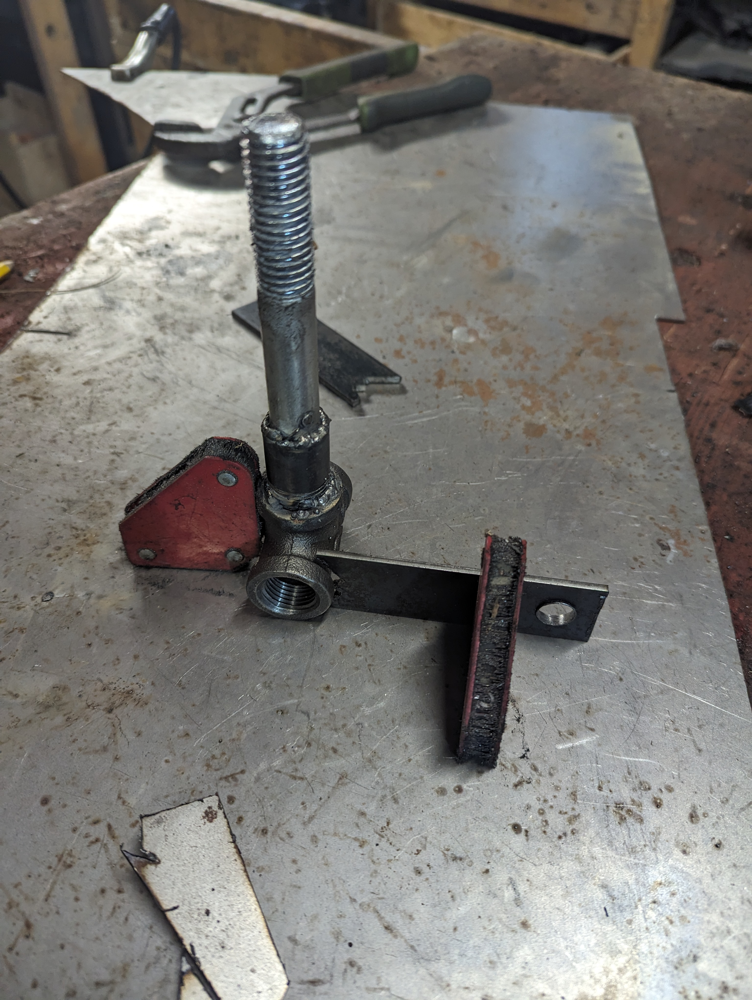
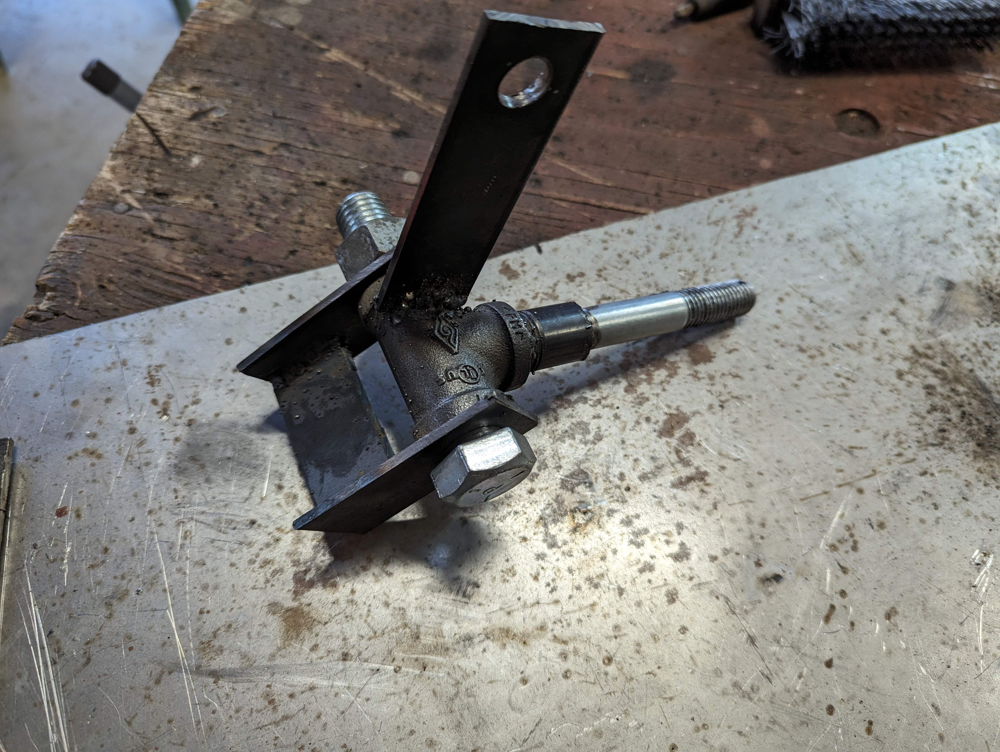
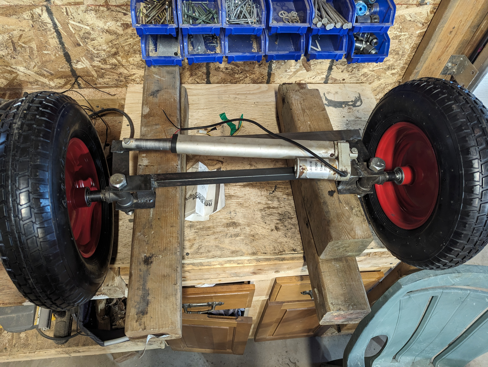
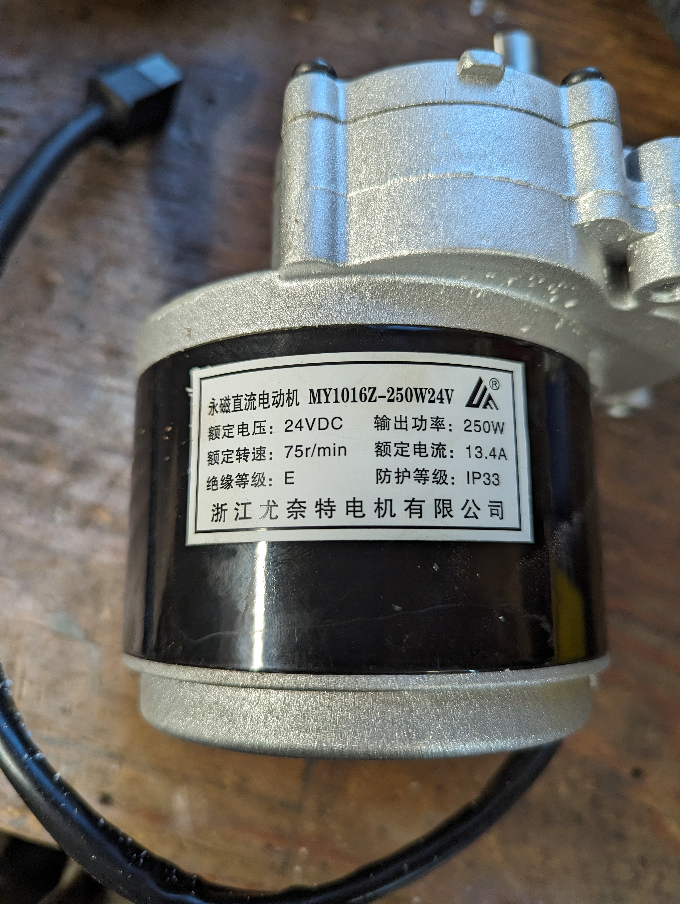
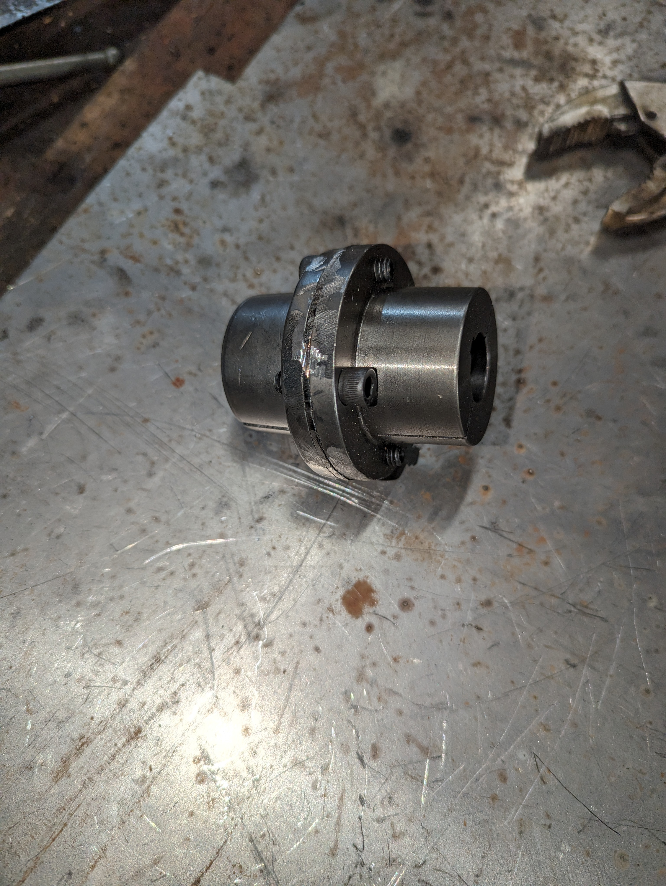

# The big rover
This is a bigger version of my [small rover](https://github.com/pdumais/small_rover). It's actually a totally different beast
but it's a project I've been thinking about the whole time I was building the small one.

# Build log
## March 7, 2024 
The first part I want to take on is the front axle and steering. For the front axle I need build a spindle.  
<figure>
    
    <figcaption>Initial parts used to build the spindle</figcaption>
</figure>

<figure>
    
    <figcaption>Ready to weld</figcaption>
</figure>
<figure>
    
    <figcaption>Finished spindle</figcaption>
</figure>

For the steering, I've been hesitating between using a linear acuator, stepper or a servo. But I couldn't find any servo or stepper that seemed powerful enough for this. I had an old actuator that I decided to use. At 12mm/s, it's a bit slow but it will do the job.

This will change the behaviour though. On my smaller robot, the angle of the steering is directly proportional to the value of the X axis of joystick on the controller. But without any position feedback or sensors, all I can do now is make the speed of the motor directly proportional to the joystick.

I also need to put stop switches on each side to make the motor stop when I reach one end. The way this would work is by having a bolt at each end of the rod, where I want the motion to stop.
This would stop the mechanical action but we also want the motor to stop forcing when it gets there. So I can put a normally-closed switch at each end. When the traveling nut hits the switch, The PWM pin
feeding the motor driver would be interrupted. But the 2nd pin would not be interrupted so it would be possible to travel back.
I also added a potentiometer to track the angle of the steering. I'm not sure yet if I'll use it though.

## March 16, 2024 
The steering is progressing. I welded everything and I'm now almost ready to build the frame

Each side has a hard stop made out of metal that prevents the the wheel from turning too much. There is also a stop-switch connected in series with the PWM input of the motor driver. So if the switch is closed, then the PWM signal to the driver gets interrupted. This will protect the actuator from burning out when it hits the metal stopper.
<figure>
    
    <figcaption>Steering</figcaption>
</figure>

## March 20, 2024 
I started building the rear axle. The first challenge I had was to link the motors to the wheel shaft. I'm using wheelchair motors that I found online. These motors have a shaft with a 17mm diameter. 
<figure>
    
    <figcaption>Wheelchair motor</figcaption>
</figure>

The wheels I'm planning on using are from an old snow blower. I was able to take off the wheels and the shaft (3/4")
Unfortunately, dealing with metric is very difficult in Canada. I couldn't find any 17mm couplings to hook up to the wheels. I tought about getting a 5/8 to 3/4 coupling and just bore the insides of the 5/8 but good luck finding a 17mm drill bit. So I resorted to buying a 11/16 and 3/4 bushing and bolt them together. 11/16 is still a bit too large for 17mm but with the key stock, it stays in place. I added a metal plate between them so I can bolt the coupling to the shaft so it doesn't slip off
<figure>
    
    <figcaption>Coupling</figcaption>
</figure>
<figure>
    
    <figcaption>Coupling</figcaption>
</figure>

The keyway in the bushing had to be filed down to make it larger to accomodate the 5mm key stock. And I only had 1/4" key stock so I had to file that down too. This project is becoming a nightmare of metric VS imperial. I wish I could work 100% metric.

Next challenge was to build a mounting bracket for the motors and build an axle that will match the height, off the ground, of the front axle. So I build this rig. The shaft between the 2x4s is exactly at the height that I need for the wheels to touch the ground. Then the motor sits on a stack of 2x4 that matches the frame height from the ground. So all I need to to bolt the motor on the square tubing and make sure nothing moves.
<figure>
    
    <figcaption>Rig for motor mounts</figcaption>
</figure>

